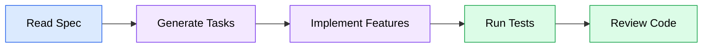
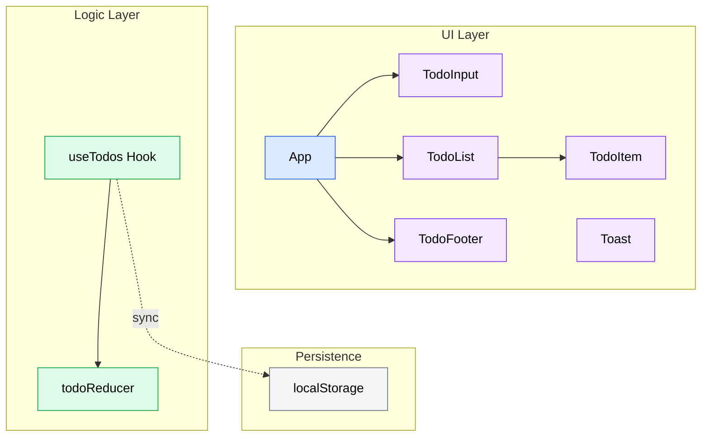

# todo-app PRD

**Version**: 1.0
**Author**: Stephen Sequenzia
**Date**: 2026-04-08
**Status**: Draft
**Spec Type**: New Product
**Spec Depth**: Detailed Specifications
**Description**: A simple web-based todo app with full CRUD functionality, built as an example project for demonstrating the SDD pipeline skills and coding agent workflows.

---

## 1. Executive Summary

A minimal, well-crafted todo application built with React, TypeScript, and modern tooling. This project serves as a reference implementation for software engineers learning to develop software using the SDD (Spec-Driven Development) pipeline and AI-assisted coding agents. The app demonstrates clean architecture patterns, proper state management with React hooks, and a polished user experience — all within a deliberately constrained scope.

## 2. Problem Statement

### 2.1 The Problem

Software engineers learning to use SDD pipeline skills and coding agents need a concrete, well-scoped example project to follow. Without a reference implementation, learners must invent their own project scope while simultaneously learning the tooling — splitting their attention and slowing adoption.

### 2.2 Current State

No reference project currently exists within this repository to demonstrate the full SDD pipeline workflow from spec creation through task generation and implementation.

### 2.3 Impact Analysis

Without a reference project, engineers must learn the SDD pipeline abstractly or create ad-hoc examples that may not showcase the workflow effectively. A well-structured example accelerates onboarding and provides a reusable template for future demonstrations.

### 2.4 Business Value

This project provides immediate value as a teaching asset. It demonstrates that even a simple CRUD application benefits from structured specification, and gives engineers a tangible artifact to study, clone, and extend when learning the SDD workflow.

## 3. Goals & Success Metrics

### 3.1 Primary Goals

1. Deliver a fully functional todo app with all specified CRUD features
2. Produce clean, well-structured code that serves as a learning example
3. Demonstrate modern React patterns (custom hooks, useReducer, component composition)

### 3.2 Success Metrics

| Metric | Current Baseline | Target | Measurement Method | Timeline |
|--------|------------------|--------|-------------------|----------|
| Feature completeness | N/A | 100% of specified features | Manual walkthrough against acceptance criteria | At delivery |
| Code quality | N/A | Clean architecture, no lint errors | Linting + code review | At delivery |
| Unit test coverage | N/A | All core logic covered | Vitest coverage report | At delivery |
| UX responsiveness | N/A | Smooth interactions, no jank | Manual testing across viewport sizes | At delivery |

### 3.3 Non-Goals

- Production deployment or hosting
- User authentication or multi-user support
- Server-side persistence or cloud sync
- Time-based features (due dates, reminders, scheduling)
- WCAG accessibility compliance

## 4. User Research

### 4.1 Target Users

#### Primary Persona: Developer Learner

- **Role/Description**: A software engineer (junior to mid-level) learning to use SDD pipeline skills and coding agents
- **Goals**: Understand how a spec translates into implementation tasks and working code; study modern React/TypeScript patterns
- **Pain Points**: Abstract documentation without concrete examples; lack of end-to-end workflow references
- **Context**: Working through the SDD pipeline for the first time, using this project as a guided example

### 4.2 User Journey Map

The developer reads this spec, generates implementation tasks via `/create-tasks`, implements each task (potentially with AI assistance), verifies with tests, and reviews the resulting code for patterns and quality.

## 5. Functional Requirements

### 5.1 Feature: Add Todo

**Priority**: P0 (Critical)

#### User Stories

**US-001**: As a user, I want to add a new todo by typing text and submitting so that I can capture tasks.

**Acceptance Criteria**:
- [ ] Text input field is visible at the top of the app
- [ ] Pressing Enter or clicking a submit button creates a new todo
- [ ] New todo appears in the list with `completed: false`
- [ ] Input field clears after successful submission
- [ ] Empty or whitespace-only input is rejected (no empty todos created)
- [ ] New todo receives a unique `id`

**Edge Cases**:
- Whitespace-only input: Treated as empty, submission blocked
- Very long text: No character limit enforced, but input should remain usable

---

### 5.2 Feature: Delete Todo

**Priority**: P0 (Critical)

#### User Stories

**US-002**: As a user, I want to delete a todo so that I can remove tasks I no longer need.

**Acceptance Criteria**:
- [ ] Each todo displays a delete button (visible on hover or always visible)
- [ ] Clicking delete removes the todo from the list immediately
- [ ] A toast notification confirms the deletion
- [ ] Deletion persists to localStorage

**Edge Cases**:
- Deleting the last todo: List displays empty state gracefully
- Rapid successive deletes: Each deletion processes independently

---

### 5.3 Feature: Toggle Complete

**Priority**: P0 (Critical)

#### User Stories

**US-003**: As a user, I want to mark a todo as complete or incomplete so that I can track my progress.

**Acceptance Criteria**:
- [ ] Each todo has a checkbox to toggle completion status
- [ ] Completed todos display with visual distinction (e.g., strikethrough text, muted styling)
- [ ] Toggling persists to localStorage
- [ ] Completed todos are not editable via inline editing

---

### 5.4 Feature: Inline Editing

**Priority**: P0 (Critical)

#### User Stories

**US-004**: As a user, I want to edit a todo's text by double-clicking it so that I can correct or update tasks without deleting and re-creating them.

**Acceptance Criteria**:
- [ ] Double-clicking a todo's text enters edit mode with the current text in an input field
- [ ] Pressing Enter saves the edited text
- [ ] Pressing Escape cancels the edit, reverting to the original text
- [ ] Clicking outside the edit field (blur) cancels the edit
- [ ] Submitting an empty string deletes the todo
- [ ] Completed todos do not enter edit mode on double-click
- [ ] Edit persists to localStorage on save

**Edge Cases**:
- Empty submit: Deletes the todo (strict behavior)
- Double-click on completed todo: No action
- Click-away while editing: Cancels edit, reverts text

---

### 5.5 Feature: Filter by Status

**Priority**: P1 (High)

#### User Stories

**US-005**: As a user, I want to filter my todo list by status so that I can focus on active or completed tasks.

**Acceptance Criteria**:
- [ ] Three filter options: All, Active, Completed
- [ ] Filter buttons are visible below or near the todo list
- [ ] Active filter is visually highlighted
- [ ] "All" shows all todos regardless of status
- [ ] "Active" shows only todos where `completed === false`
- [ ] "Completed" shows only todos where `completed === true`
- [ ] Filter state does not persist across page reloads (defaults to "All")

---

### 5.6 Feature: Active Todo Count

**Priority**: P1 (High)

#### User Stories

**US-006**: As a user, I want to see how many active (incomplete) todos remain so that I can gauge my workload.

**Acceptance Criteria**:
- [ ] Count is displayed in the footer area of the todo list
- [ ] Count updates in real-time as todos are added, deleted, or toggled
- [ ] Displays "{n} item(s) left" with correct pluralization

---

### 5.7 Feature: Clear Completed

**Priority**: P1 (High)

#### User Stories

**US-007**: As a user, I want to remove all completed todos at once so that I can clean up my list efficiently.

**Acceptance Criteria**:
- [ ] "Clear completed" button is visible when at least one completed todo exists
- [ ] Clicking the button removes all completed todos from the list
- [ ] A toast notification confirms the bulk action (e.g., "Cleared 3 completed todos")
- [ ] Button is hidden when no completed todos exist
- [ ] Removal persists to localStorage

---

### 5.8 Feature: Toggle All

**Priority**: P1 (High)

#### User Stories

**US-008**: As a user, I want to mark all todos as complete or incomplete at once so that I can manage bulk status changes.

**Acceptance Criteria**:
- [ ] A "toggle all" control (e.g., chevron or checkbox) is visible when todos exist
- [ ] If any todos are incomplete, clicking marks all as complete
- [ ] If all todos are complete, clicking marks all as incomplete
- [ ] A toast notification confirms the bulk action
- [ ] Toggle state persists to localStorage

---

### 5.9 Feature: Toast Notifications

**Priority**: P2 (Medium)

#### User Stories

**US-009**: As a user, I want brief feedback messages for destructive and bulk actions so that I have confidence my actions were processed.

**Acceptance Criteria**:
- [ ] Toast appears for: delete, clear completed, toggle all, localStorage failure
- [ ] Toast auto-dismisses after a short duration (e.g., 3 seconds)
- [ ] Toast is non-blocking and positioned unobtrusively (e.g., bottom-right)
- [ ] Toast for localStorage failure warns that data may not persist
- [ ] Uses shadcn/ui toast component

## 6. Non-Functional Requirements

### 6.1 Performance

- UI interactions (add, delete, toggle, edit) should feel instant with no perceptible delay
- localStorage reads/writes should not block the UI thread
- The app should render smoothly on modern browsers (Chrome, Firefox, Safari, Edge)

### 6.2 Security

- Not applicable — no authentication, no server, no sensitive data
- localStorage data is user-local and not transmitted

### 6.3 Scalability

- Designed for a single user with a reasonable number of todos (tens to low hundreds)
- No performance optimization required for large datasets

### 6.4 Accessibility

- Not a focus for this example project
- Basic semantic HTML is expected (buttons, inputs, labels) but no WCAG compliance target

## 7. Technical Considerations

### 7.1 Architecture Overview

A single-page React application with all state managed client-side via a custom `useTodos` hook. The hook uses `useReducer` internally to handle all todo operations (add, delete, toggle, edit, clear completed, toggle all) through a centralized reducer function. Persistence is handled as a side effect, syncing reducer state to localStorage.

### 7.2 Tech Stack

- **Frontend**: React 18+ with TypeScript
- **Build Tool**: Vite
- **Styling**: Tailwind CSS
- **UI Components**: shadcn/ui (for toast, input, button, checkbox)
- **State Management**: Custom `useTodos` hook with `useReducer`
- **Persistence**: Browser localStorage
- **Testing**: Vitest + React Testing Library

### 7.3 Integration Points

| System | Integration Type | Purpose |
|--------|-----------------|---------|
| localStorage | Browser API | Persist todos across page reloads |
| shadcn/ui | Component library | Pre-built, accessible UI primitives |

### 7.4 Technical Constraints

- No external runtime dependencies beyond React, Tailwind, and shadcn/ui
- All state is client-side; no server or API calls
- Data model is intentionally minimal: `{ id: string, text: string, completed: boolean }`
- App source code lives at `apps/todo/src` within the repository

## 8. Scope Definition

### 8.1 In Scope

- Full CRUD operations for todos (add, edit, delete, toggle complete)
- Inline editing with double-click activation
- Filter by status (All, Active, Completed)
- Active todo count display
- Bulk operations (Clear completed, Toggle all)
- Toast notifications for destructive/bulk actions and localStorage errors
- localStorage persistence
- Unit tests for core logic (reducer, custom hook)
- Clean, minimal, responsive design using Tailwind CSS and shadcn/ui

### 8.2 Out of Scope

- **Authentication & user accounts**: No login, registration, or multi-user support — this is a single-user local app
- **Cloud sync / server persistence**: No backend, API, or database — localStorage only
- **Due dates & reminders**: No time-based features — keeps the data model minimal
- **Accessibility compliance**: No WCAG target — basic semantic HTML only
- **Drag-and-drop reordering**: No sort order field in the data model
- **Categories, tags, or labels**: Keeps the feature set focused on core CRUD
- **Undo/redo**: Not required for this scope

### 8.3 Future Considerations

- Adding a backend API and database for persistent storage
- User authentication and multi-device sync
- Due dates, priorities, and categories
- Drag-and-drop reordering
- Dark mode toggle
- Keyboard shortcuts for power users

## 9. Implementation Plan

### 9.1 Phase 1: Complete Build — Single Delivery

**Completion Criteria**: All functional requirements pass acceptance criteria; unit tests pass; app runs via `npm run dev`.

| Deliverable | Description | Dependencies |
|-------------|-------------|--------------|
| Project scaffolding | Vite + React + TypeScript project at `apps/todo/src` with Tailwind and shadcn/ui configured | None |
| Data model & reducer | `Todo` type definition and `todoReducer` with all action types (ADD, DELETE, TOGGLE, EDIT, CLEAR_COMPLETED, TOGGLE_ALL) | None |
| `useTodos` hook | Custom hook encapsulating `useReducer` + localStorage sync | Reducer |
| `TodoInput` component | Text input with Enter-to-submit for adding new todos | `useTodos` hook |
| `TodoItem` component | Displays a single todo with checkbox, text, delete button, and inline editing | `useTodos` hook |
| `TodoList` component | Renders filtered list of `TodoItem` components | `TodoItem`, filter state |
| `TodoFooter` component | Active count, filter buttons, clear completed button, toggle all control | `useTodos` hook |
| Toast integration | shadcn/ui toast for delete, bulk actions, and localStorage failure feedback | shadcn/ui setup |
| Unit tests | Vitest tests for `todoReducer` and `useTodos` hook | All logic implemented |
| Responsive styling | Tailwind CSS responsive layout, clean minimal design | All components |

**Checkpoint Gate**: All acceptance criteria verified via manual walkthrough and automated tests.

## 10. Dependencies

### 10.1 Technical Dependencies

| Dependency | Owner | Status | Risk if Delayed |
|------------|-------|--------|-----------------|
| React 18+ | Meta (OSS) | Stable | None — widely available |
| Vite | Vite team (OSS) | Stable | None |
| Tailwind CSS | Tailwind Labs (OSS) | Stable | None |
| shadcn/ui | shadcn (OSS) | Stable | None — components are copied into project |

### 10.2 Cross-Team Dependencies

No cross-team dependencies. This is a self-contained example project.

## 11. Risks & Mitigations

| Risk | Impact | Likelihood | Mitigation Strategy | Owner |
|------|--------|------------|---------------------|-------|
| localStorage cleared by browser | Low | Low | Toast warns user if storage unavailable; app works in-memory as fallback | Developer |
| shadcn/ui breaking changes | Low | Low | Components are vendored into the project, not installed as a runtime dependency | Developer |

## 12. Open Questions

| # | Question | Owner | Due Date | Resolution |
|---|----------|-------|----------|------------|
| — | No open questions | — | — | All items resolved during interview |

## 13. Appendix

### 13.1 Glossary

| Term | Definition |
|------|------------|
| SDD | Spec-Driven Development — a workflow where implementation is guided by structured specifications |
| CRUD | Create, Read, Update, Delete — the four basic data operations |
| useReducer | A React hook for managing complex state logic via a reducer function |
| shadcn/ui | A collection of re-usable UI components built with Radix UI and Tailwind CSS |
| localStorage | A browser Web Storage API for persisting key-value data client-side |

### 13.2 References

- [React Documentation](https://react.dev)
- [Vite Documentation](https://vite.dev)
- [Tailwind CSS Documentation](https://tailwindcss.com/docs)
- [shadcn/ui Documentation](https://ui.shadcn.com)
- [Vitest Documentation](https://vitest.dev)

### 13.3 Reducer Action Types

The `todoReducer` should handle the following action types:

| Action | Payload | Effect |
|--------|---------|--------|
| `ADD` | `{ text: string }` | Creates a new todo with a unique id and `completed: false` |
| `DELETE` | `{ id: string }` | Removes the todo with the given id |
| `TOGGLE` | `{ id: string }` | Flips the `completed` status of the given todo |
| `EDIT` | `{ id: string, text: string }` | Updates the text of the given todo |
| `CLEAR_COMPLETED` | none | Removes all todos where `completed === true` |
| `TOGGLE_ALL` | none | Sets all todos to complete (if any incomplete) or all to incomplete (if all complete) |

---

*Document generated by SDD Tools*
